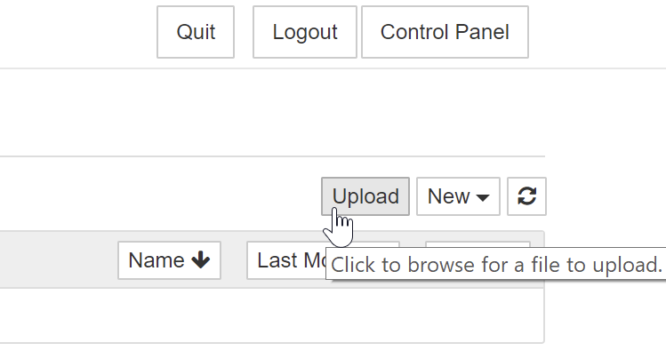

# management

[GitHub - SinglishWords/management: Some management operation](https://github.com/SinglishWords/management)

This repository consists of the working files for the Jupyter server of the SinglishWords project, written primarily using Python and Jupyter notebooks.

# Installation

To install and run the Jupyter server on your localhost, first clone this repository.

```bash
$ git clone https://github.com/SinglishWords/management.git
$ cd management # to enter the directory
```

In order to deploy the server, ensure that you have Jupyter Notebook installed. If not, you can install it using the Python package installer.

```bash
$ pip install notebook
```

Then, start the Jupyter server using

```bash
$ py -m notebook
```

This will run the Jupyter server on `[localhost:8888](http://localhost:8888)` by default.

## Setup Jupyter Server for [localhost](http://localhost) testing

If you would like to modify the database credentials being used by the notebooks to refresh and export data, then the `config.json` file can be modified. 

In order to make this modification more convenient, the following shell script has been provided.

```
$ ./setup_config.sh
```

Running the above script will automatically modify the configuration to access the MySQL database within the notebooks.

This step is particularly useful if you are testing the Jupyter server in conjunction with the backend server on localhost. To learn more about deploying the backend server, visit this [link](https://github.com/SinglishWords/singlish-words-backend).

# Structure

## Exported data

The `export-data` folder contains, in CSV form, all the

1. the current cues (`cues.csv`)
2. questions (`questions.csv`)
3. answers (`answers.csv`)
4. respondents (`respondents.csv)`)
5. combined data (`data.csv`)

If any of the above files are not present, then this means that the Notebooks in the root directory have not been run, hence, there is no exported data.

## Helper functions

`libs/database.py` contains all the helper functions for updating and retrieving data from the database. These include

1. `initMySQLConnection(configs)`
2. `getRespondents()`
3. `getAnswers()`
4. `getQuestions()`
5. `refreshMySQLQuestions()`
6. `initRedisConnection(configs)`
7. `refreshRedis()`

# Notebooks

In the root directory, the following three notebooks are present:

1. `Data Refresh.ipynb`
2. `Data Export.ipynb`
3. `Main.ipynb`

## Data Refresh

### Usage

Executing this notebook will update the questions table in the MySQL database with the questions that are line-separated in `./export-data/cues.csv`. 

That is to say, the format of the CSV file must be similar to the following, where `CueN` is a placeholder for the cue itself.

```
Cue1
Cue2
Cue3
Cue4
CueN
```

Hence, if any changes to the questions need to be made, this can be achieved by modifying the aforementioned file.

Since Jupyter does not allow for convenient modification of CSV files, one may use the Upload function in the Jupyter window to modify the `cues.csv` file. 



Ensure, however, that the file is not named incorrectly, and is in the `export-data` folder.

### Procedure

For the data refresh, we cannot overwrite all questions currently in the database. This is because, if any question has been answered, then we must preserve the `id` of the question as the answers table relates to the question table using this column.

Hence, we employ the following procedure to safely refresh questions:

- start by setting the `enable` column for all questions to `0`.
- for each question, insert it into database (the default `enable` will be `1`)
- if a question is in the list that is already in the database, set the `enable` of the row to `1`

## Data Export

### Usage

Executing this notebook will update the `./export-data` directory with all the exported data from the MySQL database.

### Procedure

After connecting to the database, the following procedure is employed:

- the `getRespondents(), getAnswers(), getQuestions()` functions retrieve all the relevant data in the MySQL database in the form of dictionaries
- Pandas is used to convert these dictionaries into `pd.DataFrame` objects
    - At this checkpoint, these data-frames are initially converted to CSV and stored in the `./export-data` folder.
- The following data-frames are merged
    - Question-Answer
        - on keys: `Answer:question_id`, `Question:id`
    - Question-Answer-Respondent
        - on keys: `Respondent:respondent_id`, `Question-Answer:id`
- The merged Question-Answer-Respondent data-frame is then exported to `./export-data/data.csv`)

## Main

### Usage

This notebook is provided for the convenient execution of `Data Export.ipynb`, followed by the creation of a download link for the compressed `./export-data` folder, in `./export-data.zip`.

This is especially useful when the Jupyter server is already deployed to the web server, removing the need for manually extracting the exported data.

To create the download link for `export-data.zip`, run both cells in the notebook, and then click on the hyperlink created in Cell 2.

# Next steps

At this point, any changes can be committed and pushed to the `master` branch of this repo. The next steps include:

1. Making changes to the frontend, if any ([refer to this link](https://github.com/SinglishWords/singlish-words-frontend))
2. Making changes to the backend, if any ([refer to this link](https://github.com/SinglishWords/singlish-words-backend))
3. Deploying the whole application in a Docker container ([refer to this link](https://github.com/SinglishWords/deployment))
